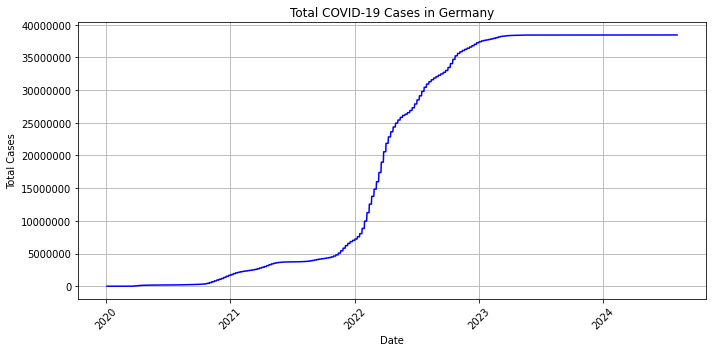
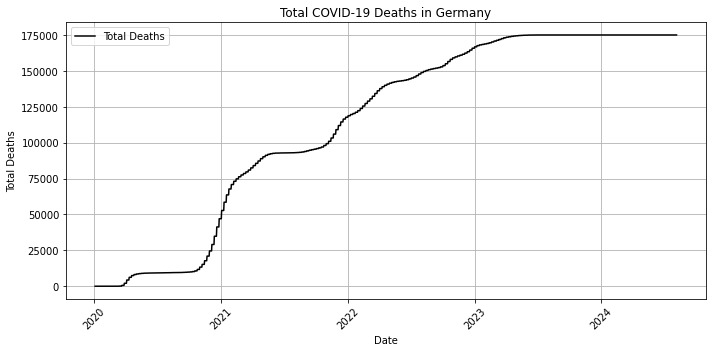
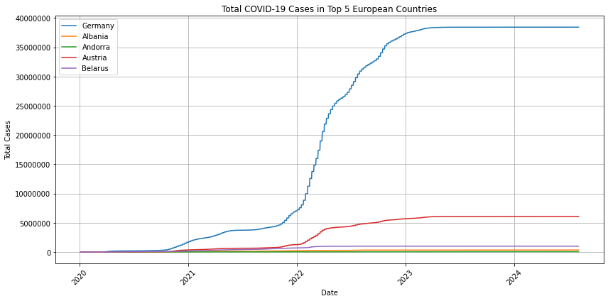

# 🦠 COVID-19 Analysis in Europe

This project explores the spread and impact of COVID-19 across selected European countries using public datasets. It includes data cleaning, aggregation, and visualizations to identify trends in total cases and deaths. The analysis was performed using **Python**, **Pandas**, **Matplotlib**, and **Databricks Notebooks**.

---

## 📊 Project Highlights

- 📈 Time-series analysis of total COVID-19 cases in Germany
- 🌍 Identification of the top 5 European countries with the highest total cases and deaths
- ⚰️ Comparative analysis and bar chart visualizations of total deaths across countries
- 🧼 Data cleaning and filtering to handle missing values and inconsistencies

---

## 🧰 Tools & Technologies

- Python (Pandas, Matplotlib)
- Databricks Notebooks
- GitHub for version control
- Dataset: [Our World in Data - COVID-19 Dataset](https://covid.ourworldindata.org/data/owid-covid-data.csv)

---

## 📁 Project Structure

covid-europe-analysis/
│
├── covid_analysis.ipynb # Main notebook with code and visualizations
├── data/ # Folder for datasets or data source info
│ └── README.md # Link to dataset source
├── images/ # Saved visualizations
└── README.md # Project documentation (this file)


---

## 📌 Sample Visualizations





---

## 🚀 How to Use

1. Clone the repository  
   ```bash
   git clone https://github.com/roysr268/covid-europe-analysis.git
